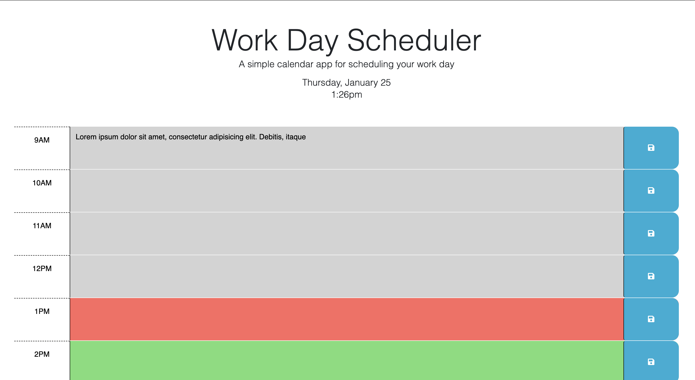

# Work Day Scheduler

## Overview
The Work Day Scheduler is a simple calendar application designed to help users schedule their work day effectively. It provides a user-friendly interface where users can input and save tasks for specific hours of the day. The scheduler visually distinguishes between past, present, and future time blocks, making it easy for users to manage their daily tasks.

## Features
- **Time Blocks:** The scheduler is divided into time blocks representing different hours of the work day.
- **Dynamic Styling:** Time blocks are dynamically styled based on whether they are in the past, present, or future.
- **Local Storage:** Tasks entered by the user are saved in the browser's local storage, allowing for persistence across page reloads.
- **Current Date and Time:** The current date and time are displayed at the top of the page, updating in real-time.

## Getting Started
1. Clone the repository to your local machine.
2. Open the `index.html` file in a web browser to use the Work Day Scheduler.

## Usage
1. Each time block represents an hour of the work day.
2. Type your tasks into the textarea of the corresponding time block.
3. Click the save button to store your task in local storage.
4. The scheduler will visually indicate whether each time block is in the past, present, or future.
5. Saved tasks will persist even if you reload the page.

## Technologies Used
- HTML
- CSS (Bootstrap for styling)
- JavaScript (jQuery for DOM manipulation)
- [Day.js](https://day.js.org/) for handling dates and times

## File Structure
- `index.html`: The main HTML file containing the structure of the scheduler.
- `style.css`: Custom CSS styles for the scheduler.
- `script.js`: JavaScript file for dynamic functionality, local storage handling, and time-related features.

## Contributing
If you'd like to contribute to the project, feel free to fork the repository and submit a pull request. Bug reports and feature requests are also welcome.

## License
This project is licensed under the [MIT License](LICENSE).

## Acknowledgments
- The Work Day Scheduler makes use of [Bootstrap](https://getbootstrap.com/) for styling and layout.
- [Day.js](https://day.js.org/) is utilized for handling dates and times in JavaScript.